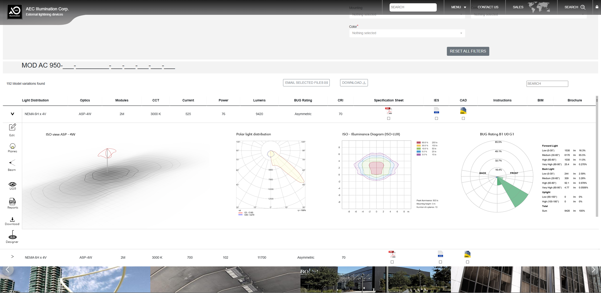
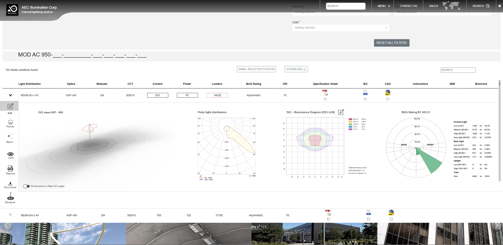
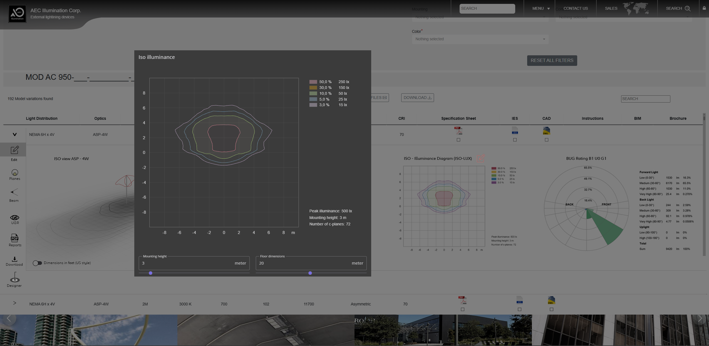
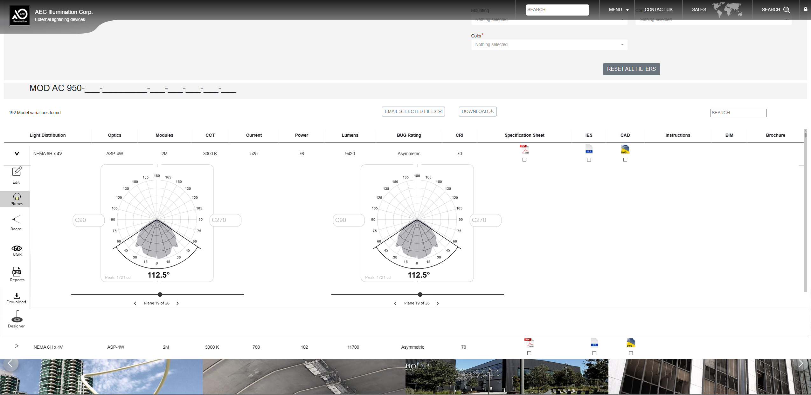
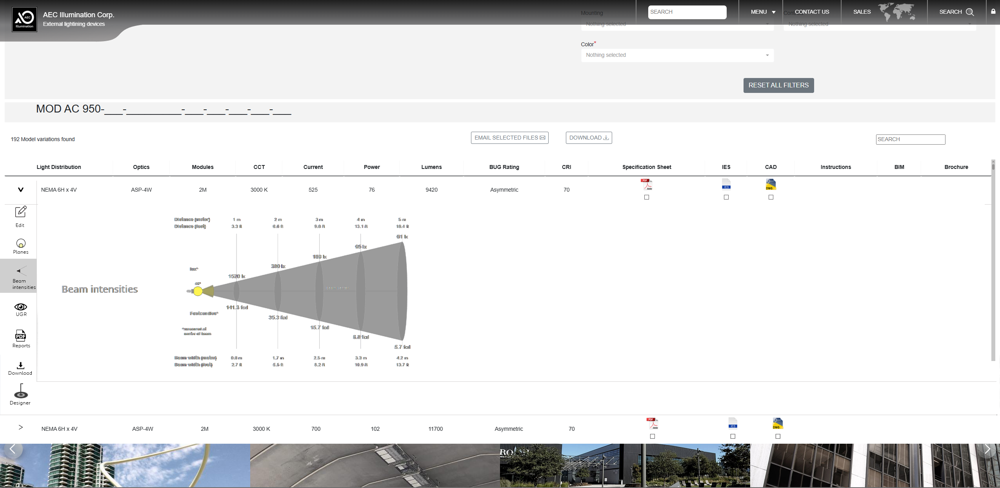
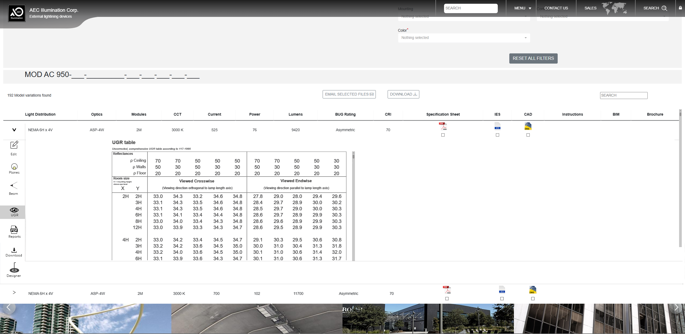
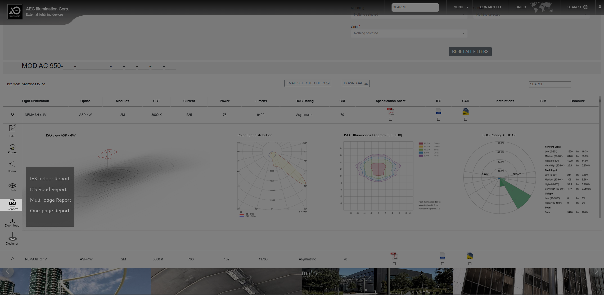
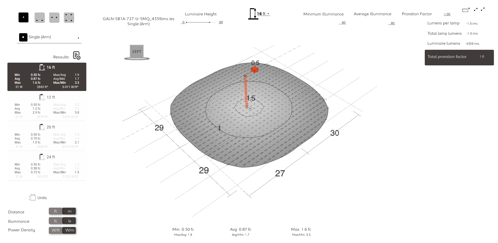

# IES and LDT File Viewer — Feature Plan

> Reference: [IES-and-LDT-Viewer.pptx](IES-and-LDT-Viewer.pptx) (AEC Illumination Corp.)

## PPTX Content Summary

### Slide 1 — Title
"IES and LDT file Viewer" — purpose: highlight functionality and readability of IES/LDT viewers.

### Slide 2 — Main Dashboard

When a file is expanded, show:
1. **ISO view image** (product photo, .jpg/.png)
2. **Polar Light Distribution** diagram
3. **ISO Illuminance Diagram** (isolux contour plot)
4. **BUG Rating** (Backlight/Uplight/Glare per IES TM-15)

Tabbed row with columns: Light Distribution, Optics, Modules, CCT, Current, Power, Lumens, BUG Rating, CRI, Spec Sheet, IES, CAD, Instructions, BIM, Brochure.

### Slide 3 — Editing Current, Power and Lumen Values

1. Switch units: US (default) or ISO/metric
2. Edit Current/Power — recalculate lumens (or vice versa)
3. Generate new file based on edited values

### Slide 4 — ISO Illuminance Editing

- Edit ISO illuminance diagram based on **Mounting Height** and **Floor Dimension** inputs
- Contour plot with isolux lines at various lux levels
- Shows: peak illuminance, uniformity ratio, number of C-planes

### Slide 5 — Photometric Solid in Polar Coordinates

- Interactive 3D photometric solid
- Adjustable **C0** and **C-Gamma** angles via sliders
- Two side-by-side views for different C-plane cuts

### Slide 6 — Beam Intensities

- Side-view beam cone visualization from luminaire to floor
- Intensity values (footcandles) at different angles
- Cross-width intensity distribution
- Beam spread geometry with distance markers

### Slide 7 — UGR (Unified Glare Rating)

- Full UGR table per CIE 117:1995
- Rows: room dimensions (2H, 4H, 8H, 12H)
- Columns: viewing directions (crosswise/endwise) at various room aspect ratios

### Slide 8 — PDF Reports

Export options:
- IES Indoor Report
- IES Road Report
- Multi-page Report
- One-page Report

### Slide 9 — Designer / Illuminance Calculator

- Reference tool: Luxiflux Area (https://v1-area-tools.luxiflux.com/)
- 3D illuminance visualization on a surface grid
- Inputs: Luminaire Height, Min/Avg/Max illuminance, Prorating Factor
- Isolux contours on floor with distance markers
- Multiple mounting height presets (16ft, 12ft, 20ft, 24ft)

---

## Gap Analysis vs. Eulumdat-RS

| Feature | Status | Location / Notes |
|---------|--------|------------------|
| Polar Light Distribution | ✅ Done | `crates/eulumdat/src/diagram/polar.rs`, SVG rendering in `svg.rs` |
| BUG Rating | ✅ Done | `crates/eulumdat/src/bug_rating.rs`, WASM component, FFI, Python, all platforms |
| Beam Intensities / Cone | ✅ Done | `crates/eulumdat/src/diagram/cone.rs` (ConeDiagram + ConeIlluminanceTable), WASM `cone_diagram.rs` + `beam_angle_diagram.rs` |
| Unit Switching (US/ISO) | ✅ Done | `UnitSystem` with m/ft, lux/fc conversions, integrated in WASM views |
| Photometric Solid | ✅ Done | egui 3D viewer in `eulumdat-ui`, Bevy 3D in `eulumdat-bevy` |
| UGR Table | ✅ Done | `crates/eulumdat/src/calculations.rs` — full CIE 117 (`ugr()`, `ugr_table()`, 19 room sizes × 5 reflectance combos × 2 viewing directions) |
| ISO Illuminance Diagram | ✅ Done | `crates/eulumdat/src/diagram/isolux.rs` (IsoluxDiagram + IsoluxParams + contours), marching squares in `contour.rs`, SVG rendering |
| Illuminance Calculator | ✅ Done | IsoluxDiagram (2D floor grid), Bevy 3D floor illuminance, `point_illuminance()`, spacing criteria |
| PDF Reports | ✅ Done | `crates/eulumdat-typst/` — Typst pipeline with sections (Summary, Diagrams, BUG, Validation, Comparison), direct PDF compilation |
| Current/Power/Lumen Editing | ⚠️ Partial | LDT field editing exists in WASM editor; missing: power↔lumen recalculation workflow |
| Product Image (.jpg/.png) | ⚠️ Trivial | SVG diagrams are superior (vector, data-driven, scalable); raster export (PNG/JPEG from SVG) is a straightforward addition via `resvg`/`tiny-skia` |

---

## Remaining Work

### 1. Power ↔ Lumen Recalculation (⚠️ Partial)

**What exists:** LDT field editing in WASM editor, lamp set data with wattage/flux fields.

**What's needed:**
- UI workflow: edit Current or Power → auto-recalculate Lumens (proportional scaling)
- Inverse: edit Lumens → recalculate Power
- Regenerate/export modified LDT/IES file with new values

**Core logic:** Proportional scaling — `new_flux = old_flux × (new_power / old_power)`. The math is trivial; this is mainly a UI/UX task.

### 2. Raster Image Export — PNG/JPEG (⚠️ Trivial)

**What exists:** All diagrams generate SVG strings via `to_svg()` methods. `resvg` 0.42 is already a dependency in `eulumdat-egui`.

**What's needed:**
- Add optional `raster-export` feature to the core `eulumdat` crate (or a thin helper crate)
- SVG → PNG/JPEG pipeline: `svg_string → resvg::render() → tiny-skia::Pixmap → encode`
- Expose in CLI (`--format png/jpg`), WASM (download button), and report generation

**Approach:** Feature-gated (`resvg`, `tiny-skia`, `png`, `jpeg-encoder`) to keep the core lib lightweight by default.

### 3. Report Template Variants (Nice-to-have)

**What exists:** Full Typst report pipeline with configurable sections (compact vs full).

**What could be added:** Specific templates matching the PPTX's dropdown:
- IES Indoor Report (office/commercial focus)
- IES Road Report (street lighting focus)
- Multi-page Report (all sections)
- One-page Report (compact summary)

These are template configuration presets, not new functionality.
